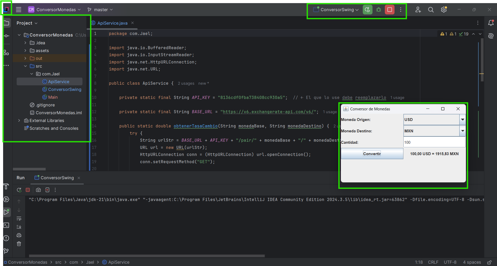
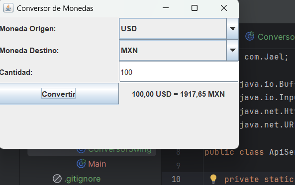

# 💱 Conversor de Monedas – Challenge Oracle ONE + Alura Latam

Este proyecto es parte del challenge de Oracle ONE + Alura Latam en la formación Java Backend.  
Desarrollamos un conversor de monedas en Java que consume una API externa para obtener tasas de cambio en tiempo real.

---

## ✅ Funcionalidades

- Conversión entre múltiples monedas (USD, MXN, EUR, ARS, BRL...)
- Interfaz de consola interactiva
- Bucle continuo hasta que el usuario decida salir
- Versión gráfica con Java Swing (extra)
- Manejo de errores
- Consumo de API REST con `HttpURLConnection`

---

## 🌐 API utilizada

Usamos **ExchangeRate API** por su facilidad de uso y datos actualizados.

---

## 🔐 ¿Cómo obtener tu clave API?

1. Visita [https://www.exchangerate-api.com](https://www.exchangerate-api.com)
2. Regístrate con tu correo electrónico.
3. Recibirás una clave (API key) por email.
4. Sustitúyela en el archivo `ApiService.java`, donde se encuentra esta línea:

```java
private static final String API_KEY = "your-api-key-aqui";
````

---

## 🚀 Cómo clonar y ejecutar este proyecto

### 1. Clonar el repositorio

```bash
git clone https://github.com/JaelJuarezRamos/conversor-monedas-java-v2
cd ConversorMonedas
```

### 2. Abrir el proyecto en tu IDE

Usamos IntelliJ IDEA como entorno de desarrollo, pero puedes usar cualquier IDE compatible con Java.

### 3. Agregar tu clave API

Abre el archivo `ApiService.java` y sustituye `"your-api-key"` por tu clave real.

### 4. Ejecutar el proyecto

* **Opción 1: Consola**
  Ejecuta la clase `com.jael.Main`
  Esto mostrará un menú de conversiones directamente en la consola.

* **Opción 2: Interfaz Gráfica (Swing)**
  Ejecuta la clase `com.jael.ConversorSwing`
  Aparecerá una ventana visual con menús desplegables, campos y botón para convertir.

---

## 📁 Estructura del proyecto

ConversorMonedas/
├── assets/ ← Capturas de pantalla del proyecto
│   ├── consola.png
│   └── conversion.png
├── src/
│   └── com/
│       └── jael/
│           ├── Main.java ← Lógica principal (versión consola)
│           ├── ApiService.java ← Clase para consumo de la API
│           └── ConversorSwing.java ← (opcional) Versión gráfica con Swing
├── README.md ← Documentación del proyecto
├── .gitignore ← Archivos ignorados por Git
└── ConversorMonedas.iml ← Configuración del proyecto IntelliJ

---

## 🛠️ Tecnologías usadas

* Java 17
* Java Swing
* API REST
* IntelliJ IDEA
* Git & GitHub

---

## 🖼️ Capturas del proyecto

### Menú en consola



### Resultado de conversión



🎥 **Video demostrativo (modo consola)**:
[Ver en Imgur »](https://imgur.com/5lc8iy4)

---

## 👨‍💻 Créditos

Proyecto desarrollado por **Jael Juárez Ramos** como parte del programa [Oracle Next Education](https://www.oracle.com/mx/education/oracle-next-education/) en colaboración con [Alura Latam](https://www.aluracursos.com/).

📣 Comparte este proyecto usando los hashtags: `#OracleNextEducation` y `#AluraLatam`

---

¡Gracias por visitar este proyecto! 🚀


